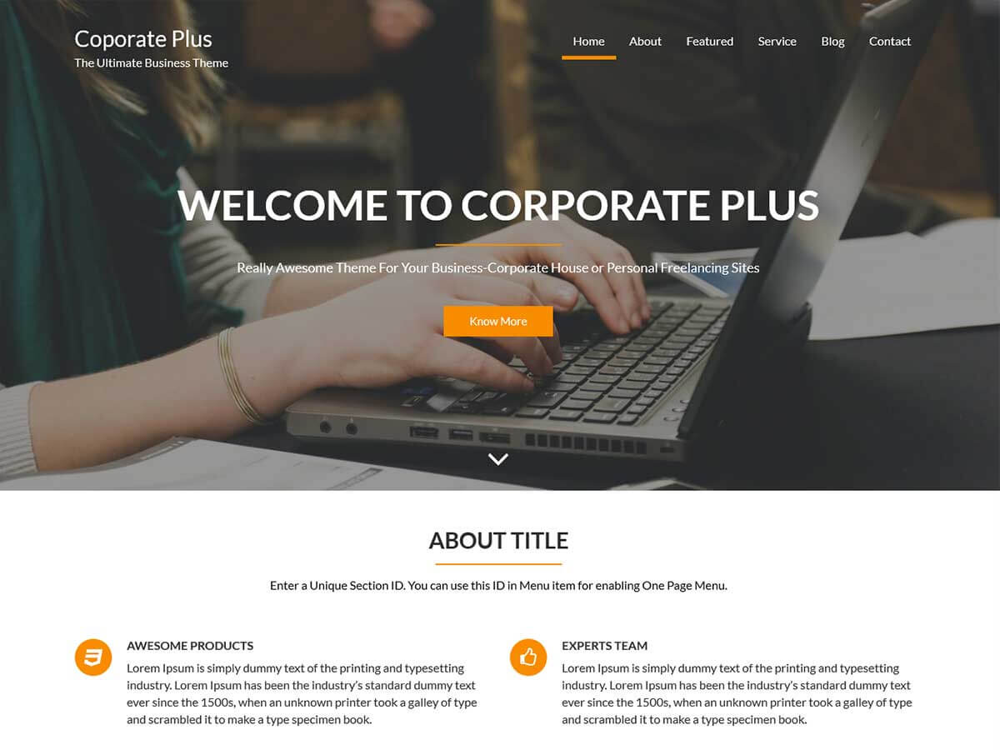

# Corporate Plus

**Contributors:** acmethemes  
**Requires at least:** 6.6  
**Tested up to:** 7.0  
**Requires PHP:** 7.4  
**Stable tag:** 4.0.0  
**License:** GPLv2 or later  
**License URI:** https://www.gnu.org/licenses/gpl-2.0.html  

> 

Corporate Plus is a professional multi-purpose WordPress theme suited for corporate sites, startups, and agencies. It's one-page ready, comes with a parallax slider, and includes dedicated sections for services, about, blog, and contact — all fully customizable without touching code.

## Features

- **One-page ready** — build a single-page site with section navigation
- **Parallax slider** — full-screen, responsive slider with parallax effect
- **Dedicated sections** — about, services, blog, and contact areas
- **Sticky menu** — navigation follows as users scroll
- **WooCommerce compatible** — sell products or services online
- **Up to four-column layouts** — flexible grid for any page
- **Full-width template** — landing pages that make an impact
- **Fully widgetized** — arrange content with drag-and-drop widgets
- **Footer widgets** — contact, links, and social in the footer
- **Acme Demo Setup** — import demo content for a quick start
- **Custom background & colors** — match your brand identity
- **Custom logo & menu** — full header control
- **Translation ready** — .pot file included
- **RTL support** — right-to-left language compatible
- **Child theme ready** — extend without breaking updates
- **SEO friendly & cross-browser compatible** — works everywhere

## Installation

1. Download the theme zip file.
2. In your WordPress admin, go to **Appearance → Themes**.
3. Click **Add New** → **Upload Theme**.
4. Select the zip file and click **Install Now**.
5. Click **Activate**.

## Frequently Asked Questions

### How do I set up the one-page layout?

Go to **Appearance → Customize** and configure each section — slider, about, services, blog, and contact. Then set a static front page in **Settings → Reading**.

### How do I import demo content?

Install the **Acme Demo Setup** plugin and choose the Corporate Plus demo from the import screen.

## Credits

Corporate Plus is built on [Underscores](https://underscores.me/) and licensed under GPLv2 or later. It bundles the following third-party resources:

- [Google Fonts](https://fonts.google.com/) — Apache License 2.0
- [Font Awesome](https://fontawesome.com/) — MIT / SIL OFL 1.1
- [normalize.css](https://necolas.github.io/normalize.css/) — MIT
- [Bootstrap](http://getbootstrap.com/) — MIT
- [Isotope](https://isotope.metafizzy.co/) — GPLv3
- [Magnific Popup](https://github.com/dimsemenov/Magnific-Popup) — MIT
- [Theia Sticky Sidebar](https://github.com/WeCodePixels/theia-sticky-sidebar) — MIT
- [Breadcrumb Trail](https://github.com/justintadlock/breadcrumb-trail) — GPLv2+
- [TGM Plugin Activation](http://tgmpluginactivation.com/) — GPLv2+
- [html5shiv](https://github.com/afarkas/html5shiv) — MIT
- [Respond.js](https://github.com/scottjehl/Respond) — MIT
- [Waypoints](https://github.com/imakewebthings/waypoints/) — MIT
- [WOW](https://github.com/matthieua/WOW) — MIT
- [Slick](https://github.com/kenwheeler/slick/) — MIT
- [Easy Pie Chart](https://github.com/rendro/easy-pie-chart/) — MIT/GPL

---

[Demo](http://www.demo.acmethemes.com/corporate-plus/) &middot; [Support](https://www.acmethemes.com/supports/) &middot; [Acme Themes](https://www.acmethemes.com)
